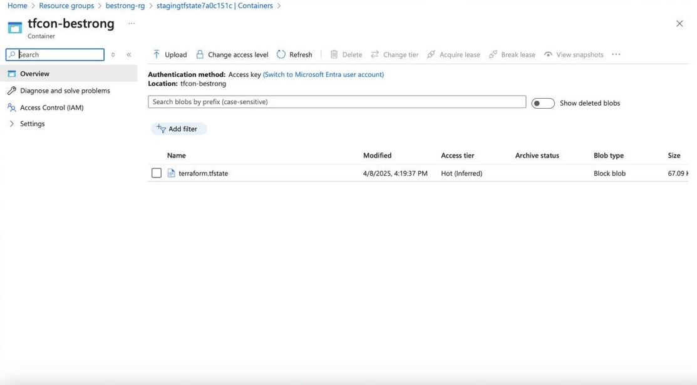

Terraform Infrastructure Setup for Azure

overview

        1 App Service Plan
        1 App Service - integrate with VNet, enable System Managed Identity
        1 Application Insights - linked to App Service
        1 ACR - Azure Container Registry, grant App Service Identity access to it
        1 Key Vault - grant permissions to App Service Identity, integrate with VNet
        1 VNet
        1 MS SQL Server DB - Private Endpoint needs to be configured
        1 Storage account - configure Private Endpoint with VNET and mount Fileshare to App Service
        1 Storage account for Terraform state

Setup

1.create files for the main structure and implement modularity 
    main.tf
    variables.tf
    outputs.tf
    *.tfvars

        modules/
    ├── appservice
    ├── container_registry
    ├── keyvvault
    ├── network
    ├── sql
    └── storage

2.
Compute & Hosting

        App Service Plan: The foundation for hosting my application
        App Service: The web application hosting service
        
        Integrates with VNet for network isolation
        Uses System Managed Identity for secure authentication
        Linked to Application Insights for monitoring
        Has access to ACR for container deployments
        Has permissions to access Key Vault secrets
        Mounts a File Share from Storage account

Monitoring

        Application Insights: Application performance monitoring solution
        Linked to App Service to collect telemetry data

Registry & Image Management

        Azure Container Registry (ACR): Stores and manages container images
        App Service Identity has access permissions to pull images

Security & Secrets Management

        Key Vault: Secure storage for secrets, keys, and certificates
        Grants permissions to App Service Identity
        Integrates with VNet for network isolation

Networking

        Virtual Network (VNet): Network isolation layer
        Connects to App Service via integration
        Connects to Key Vault via integration
        Hosts Private Endpoints for SQL Server and Storage

Data Storage

        MS SQL Server DB: Database service
        Configured with Private Endpoint connected to VNet for secure access

Storage

        Storage Account #1: Primary storage for application
        Configured with Private Endpoint connected to VNet
        Provides File Share mounted to App Service

        Storage Account #2: Dedicated for Terraform state files
        Stores infrastructure state for Terraform deployments

**3.Deploy resources to the cloud**

    
        terraform init (wee need to comment terraform backend config to run it locally first)
*optional* terraform fmt and terraform validate to check syntax and dependencies
        terraform **plan**
        terraform **apply**
        (tfstate is local atm)

        then transfer state to remote by doing this

        terrafrom init -backend-config=backend.config
        terraform init again with backend config to initialize remote state

        all resources 

        app service plan

        app service integrate with vnet and system managed identity

        application insights

        azure container registry with pull access

        key vault with access to secrets and integrated with vnet

        vnet with subnets

        mssql server with db and private endpoints

        storage with private endpoint and fileshare

