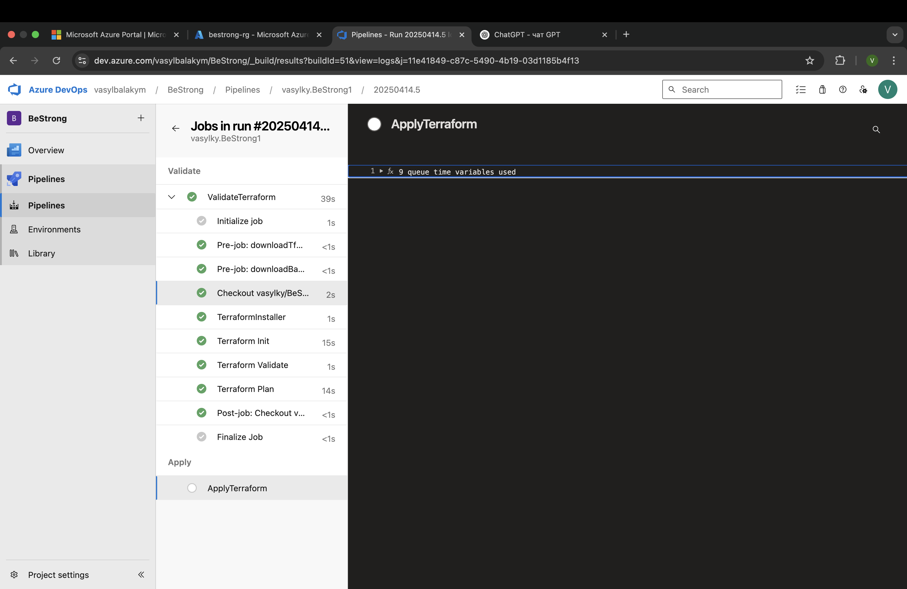

1) Use Trunk Based development flow for the CI/CD (https://trunkbaseddevelopment.com/ "https://trunkbaseddevelopment.com/") 
2) Commit your current Terraform code into main branch of your Github repository 
3) Create your Azure DevOps organization. 
4) Request free Azure agent (If you haven't yet. Request to Microsoft may take 1-2 business days) 
5) Write your own Azure DevOps Pipeline build flow using YAML syntax and commit it into your GitHub. 
6) Build and deploy from the main branch. 
7) CI/CD pipeline should include the following steps: terrafrom init, terraform validate and terraform apply. CI/CD on PR should include the following steps: terrafrom init, terraform validate and terraform plan. 
8) Create a pipeline in Azure DevOps from YAML file and deploy infrastructure into Azure Cloud using Terraform in CI/CD. Use Github service connection to access the repo, Azure service principal connection to grant Azure agent the necessary permissions to perform actions on Azure.

*create storage account and container manually to store tfstate*

*create new branch feature/kvaccess*
*make change to kv config file and open pr,so validate proccess can start*

*validate stage going good and apply not started*

*merge*

*all resources*

